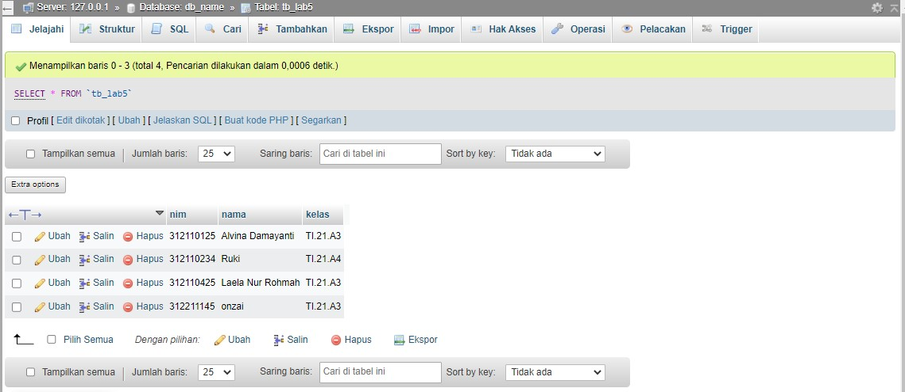

## Praktikum 5: PHP MODULAR

Nama: Laela Nur Rohmah

Nim: 312110425

Kelas: TI.21.A.3   

## buat file baru dengan nama mobil.php

code :

output

## Class Library

## Contoh class library untuk membuat form

buat file baru dengan nama form.php

code :

## Contoh implementasi pemanggilan class library form.php

1. buat file baru dengan nama form_input.php

2. Untuk database connection dan query, buat file dengan nama database.php

## Tmpilan output

## Tampilan Database

## TUGAS Lab 5

Implementasikan konsep modularisasi pada kode program pada praktukum sebelumnya dengan menggunakan class library untuk form dan database connection.

## Langkah-Langkah

1. Buat folder baru dengan nama bebas; contoh Lab5Tugas pada docroot webserver (htdocs)

2. Buat file baru dengan nama .htaccsess

3. Buat file baru dengan nama index.php

4. Buat file baru dengan nama config.php

5. Buat file baru dengan nama database.php

6. Buat file baru dengan nama header.php

7. Buat file baru dengan nama footer.php

8. Buat file baru dengan nama home.php

output :

9. Buat file baru dengan nama about.php

output:

10. Buat file baru dengan nama contact.php

output :

11. Buat file baru dengan nama add.php

12. Buat file baru dengan nama form.php

output tambah :

13. Buat file baru dengan nama update.php

output :

14. Buat file baru dengan nama delete.php

